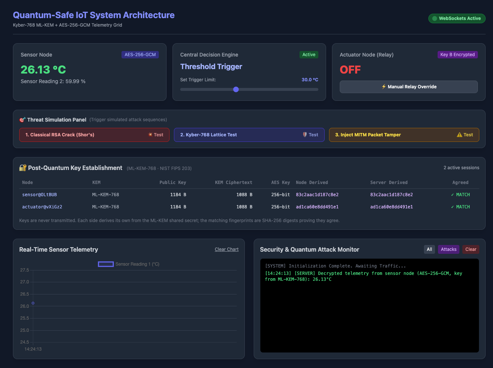

# SIS-01 — A Post-Quantum Safety Instrumented System

A working demonstrator of an emergency shutdown safety function protected with
post-quantum cryptography. A temperature transmitter streams authenticated
telemetry to a logic solver; crossing the trip setpoint **latches** a trip and
closes valve XV-101; and the valve only obeys commands it can cryptographically
authenticate, from a server it has cryptographically identified.

It is modelled on the 2017 **TRITON/TRISIS** attack on Schneider Triconex safety
controllers, so the design question throughout is not "can an eavesdropper read
this" but "what happens when someone is already inside".

Session keys are established with **ML-KEM-768** (NIST FIPS 203, the
standardised form of CRYSTALS-Kyber). Identities and control actions are signed
with **ML-DSA-65** (NIST FIPS 204, CRYSTALS-Dilithium). The data channels are
**AES-256-GCM**.

  



## Why this is quantum-resistant

| Layer | Algorithm | Quantum threat | Status |
|---|---|---|---|
| Transport | MQTT over TLS 1.3 | — | Tunnel only; payloads sealed independently |
| Key exchange | ML-KEM-768 | Shor's algorithm breaks RSA/ECDH outright | Module-LWE has no known quantum attack |
| Identity & control actions | ML-DSA-65 | Shor's algorithm breaks RSA/ECDSA signatures | Lattice signatures, so the authentication survives too |
| Bulk encryption | AES-256-GCM | Grover's algorithm halves the search space | 256-bit key → 128-bit effective, still infeasible |
| Message integrity | GCM authentication tag | — | Forged packets rejected before XV-101 moves |

Signing a post-quantum handshake with a classical signature would reintroduce
exactly the weakness ML-KEM removes, which is why the signature layer is ML-DSA
rather than RSA or ECDSA.

## Architecture

```
   sensor.py ──┐                         ┌── actuator.py  (XV-101)
  (ML-KEM +    │                         │   (ML-KEM + ML-DSA
   ML-DSA +    │                         │    + AES-GCM +
   AES-GCM)    ▼                         ▲     dead-man watchdog)
          ┌─────────────────────────────────┐
          │      server.py — logic solver   │──── dashboard (browser, view only)
          │  per-node ML-KEM handshake      │
          │  latching trip decision         │◄─── operator.py (ML-DSA signed)
          │  sealed heartbeat ─────────────►│
          └─────────────────────────────────┘
               ▲                         ▲
   ESP32 ──────┘                         └────── attack.py
  (BPCS lane,                                    (3-stage demo)
   AES-GCM, PSK)
```

Nodes never talk to each other; everything routes through the server. The two
safety links use **independently negotiated keys**, so compromising one leg does
not expose the other.

### The handshake

Every node starts with no key at all:

1. Node sends `pqc_hello` with its role
2. Server generates a **fresh ML-KEM-768 keypair per node** and returns the 1184-byte encapsulation key, **signed with ML-DSA-65**
3. Node verifies that signature against the server's enrolled public key, and aborts if it fails
4. Node encapsulates → derives a shared secret, returns the 1088-byte KEM ciphertext, **signed with its own enrolled key**
5. Server verifies the device is enrolled and the signature covers the exact key it offered, then decapsulates → arrives at the identical secret
6. Both run `HKDF-SHA256(secret, info=<link label>)` → a 32-byte AES-256 key

Because the keypair is fresh per connection, wiping the key on shutdown is
genuine forward secrecy. HKDF domain separation guarantees the sensor and
actuator links can never derive the same key. The signed transcript binds the
role and both halves of the exchange, so a captured signature cannot be replayed
into a different handshake or reused to enrol under a different role.

## What makes it a safety system, not a thermostat

**The trip latches.** Reaching the setpoint sets `TRIPPED` and sends `TRIP`.
Cooling back down does not clear it — the plant getting colder is not evidence
that whatever caused the excursion has been dealt with. Only a signed operator
`RESET` clears it. The thermostat's hysteresis band was deleted along the way: it
existed to stop a two-edge controller chattering around the setpoint, and a latch
has one edge, so there is nothing left for it to do.

**Losing the network closes the valve.** The server seals a heartbeat to each
actuator every 2 s under that actuator's own session key. The actuator trips
XV-101 locally after 6 s without an authenticated beat, and the decision lives on
the node holding the valve precisely so it survives the case where the server is
unreachable. This replaced a fail-danger path: the old logic dropped the command
and logged a line when no actuator was reachable, which froze the final element
wherever it happened to be. Heartbeats carry a sequence number, so replaying a
captured beat cannot hold the watchdog open.

**Safety actions require a signed operator command.** Moving the trip setpoint,
clearing a latched trip, and asserting a maintenance bypass all go through
`app/nodes/operator.py`, which signs the action with an enrolled operator's
ML-DSA-65 key. The dashboard is a view; a browser has nowhere safe to keep a
signing key.

A verified signature is necessary and not sufficient. The Oldsmar water-treatment
intruder used a legitimate remote-access path, so the server also refuses a
command when:

- the operator is not enrolled, or the signature does not verify
- the nonce is missing or already used (each command is single-use)
- the timestamp is more than 30 s from server time
- the setpoint falls outside 40–120 °C
- the setpoint moves more than 15 °C in a single step

A correctly signed request to move the trip setpoint by sixty degrees is refused
exactly like an unsigned one.

**The unsigned handlers still exist, and always refuse.** `set_threshold`,
`toggle_actuator_override` and `resume_automatic` are kept in the server so the
demonstration can show the unsigned path being turned away next to the signed one
working. They are not dead code awaiting repair — the refusal is the point.

**The ESP32 is on the basic process control lane, not the safety lane.** It runs
on a provisioned pre-shared key rather than the ML-KEM/ML-DSA handshake, so its
readings are decrypted, displayed and logged, but cannot trip the plant. A leg
that cannot prove who it is does not get to move the safety function.

## Quick start

```bash
python -m venv .venv && source .venv/bin/activate
pip install -r requirements.txt

make enroll     # once — ML-DSA identities for the server, the nodes, operator-01
make server     # terminal 1 — dashboard at http://127.0.0.1:5001
make sensor     # terminal 2
make actuator   # terminal 3
make attack     # terminal 4 (optional — dashboard has buttons for this)
```

Signed operator actions, from any terminal:

```bash
make operator ARGS="setpoint 85"   # move the trip setpoint
make operator ARGS=reset           # clear a latched trip
make operator ARGS="bypass on"     # assert the maintenance bypass
```

Skip `make enroll` and the server starts unauthenticated, says so in the log, and
refuses every operator command — which is itself worth showing once.

Open <http://127.0.0.1:5001> for the live dashboard: telemetry chart, trip state,
valve position, setpoint, and a colour-coded security log.

> **Port 5001, not 5000.** On macOS the AirPlay Receiver occupies port 5000 and
> answers with a 403 that looks convincingly like a CORS failure.

## Tests

```bash
make test         # crypto, latching trip logic, identity, operator auth, heartbeat watchdog
make test-device  # ESP32 wire format (server must be running)
```

## The attack demonstration

Three stages, from the dashboard buttons or `app/attacks/attack.py`:

1. **Classical break** — *real.* `make sensor-legacy` brings up an RSA
   key-transport channel; the stage factors the modulus and recovers the session
   key from captured traffic. The modulus is deliberately small so it completes
   in milliseconds; Shor's algorithm is what makes the equivalent recovery
   feasible against RSA-2048, and that part is cited, not simulated.
2. **Lattice attack** — *real.* Captures a genuine 1184-byte ML-KEM public key
   off the wire, then shows that encapsulating against it twice produces two
   unrelated secrets, so recorded traffic yields nothing. It reports the
   Module-LWE search space rather than pretending to solve it.
3. **Man-in-the-middle bit-flip** — *real.* Injects a forged ciphertext at the
   actuator. The GCM tag check rejects it and XV-101 never moves.

Stage 3 is the payoff: tampering is not merely detected, it is detected *before*
a physical final element acts on it.

## Hardware

`firmware/` contains ESP32 firmware, wiring, and setup notes. The board performs a
real DHT22 read and real AES-256-GCM through the ESP32's mbedtls hardware
crypto, then POSTs to the server's `/telemetry` route.

Runs in the browser on [Wokwi](https://wokwi.com) or on a physical ESP32 —
identical sketch. [`firmware/README.md`](firmware/README.md) has the step-by-step,
including the free-account route (public gateway + a `cloudflared` tunnel, since
Wokwi's private gateway is a paid feature).

**The ESP32 does not run the handshake.** It uses a provisioned pre-shared key
(`DEVICE_PSK`), duplicated in `app/config.py` and `sketch.ino`. Keeping ML-KEM off
the microcontroller was a deliberate scope decision; this is the one remaining
pre-shared key in the system, and the reason the board sits on the BPCS lane
where it cannot trip the plant.

## Layout

```
app/           server, crypto, dashboard, identity
  nodes/       sensor, actuator, operator console, ESP32 stand-in
  transport/   MQTT over TLS + broker
  attacks/     the attack stages
tests/         crypto, identity and wire-format checks
firmware/      ESP32 sketch and wiring
docs/          SIS refactor contract, block diagrams
scripts/       certificate generation
```

Run `make` on its own to list every command.

| File | Role |
|---|---|
| `app/pqc.py` | ML-KEM-768 keygen / encapsulation / HKDF derivation |
| `app/identity.py` | ML-DSA-65 keys, signed transcripts, the enrolment registry |
| `app/enroll.py` | One-time provisioning of server, device and operator identities |
| `app/server.py` | Flask-SocketIO logic solver: handshake state, latching trip, heartbeat, operator command verification |
| `app/nodes/sensor.py` | Safety transmitter |
| `app/nodes/actuator.py` | XV-101 and its dead-man watchdog |
| `app/nodes/operator.py` | Signed operator console — the only path to safety state |
| `app/attacks/attacks.py` | Attack stages, shared by the CLI and the dashboard buttons |
| `app/attacks/attack.py` | CLI runner for the attack sequence |
| `app/nodes/device_sim.py` | ESP32 stand-in — the BPCS leg without hardware |
| `app/transport/broker.py` | Pure-Python MQTT broker with TLS 1.3 |
| `app/config.py` | Setpoint, clamps, heartbeat timings, network config, ESP32 pre-shared key |
| `app/templates/index.html` | Dashboard |
| `docs/SIS_CONTRACT.md` | Source of truth for the SIS refactor |
| `firmware/` | ESP32 firmware and wiring |

## Honest limitations

These were found by attacking the running system, not by reasoning about it.
`docs/` has no separate threat model — this list is it.

**Still exploitable:**

- **`DEVICE_PSK` ships in this repository.** Anyone reading the source can forge
  ESP32 telemetry. Override it with the `DEVICE_PSK` environment variable. This
  is the accepted residual risk of keeping ML-KEM off the microcontroller, and it
  is contained by keeping that leg off the safety path entirely.
- **No auth on the dashboard.** Anyone who reaches the page can watch the plant
  and run the attack demonstrations. They cannot change safety state — that needs
  an enrolled operator's signing key — but the page itself is unprotected.
- **`identities.json` holds the server's signing key in plaintext**, mode 0600 and
  gitignored. A real deployment puts it in an HSM or a secure element.

**Fixed after testing:**

- **No device authentication** — nodes now prove identity with ML-DSA-65 against
  an enrolment registry. A client that merely claims to be the actuator is
  refused.
- **Unauthenticated handshake** — the server signs the encapsulation key it
  offers, so a man in the middle present from the first packet cannot substitute
  their own.
- **Unauthenticated safety actions** — moving the setpoint or overriding the final
  element used to be an unsigned dashboard message. Those handlers now always
  refuse; the signed `operator_command` path replaced them.
- **Fail-danger on link loss** — an unreachable actuator used to mean a dropped
  command and a log line. The dead-man heartbeat now closes the valve instead.
- **Replay** — the server records the nonce of every accepted packet, so a
  captured packet is usable exactly once. Second copy gets HTTP 409. Operator
  commands carry their own nonce and a 30 s freshness bound.

**Other caveats:**

- Attack 1 factors a deliberately small RSA modulus so the break completes in
  milliseconds. The quantum step is cited, not simulated.
- Nonces come from `os.urandom` / `esp_random`; there is no nonce-reuse counter
  on the device side.
- Accepted-nonce sets grow unbounded within a session lifetime, which is fine for
  a demo and would want a sliding window in a long-lived deployment.

## Built with

Python 3.14 · Flask · Flask-SocketIO · [`kyber-py`](https://pypi.org/project/kyber-py/) · [`dilithium-py`](https://pypi.org/project/dilithium-py/) · `cryptography` · Chart.js · Tailwind · ESP32/mbedtls
